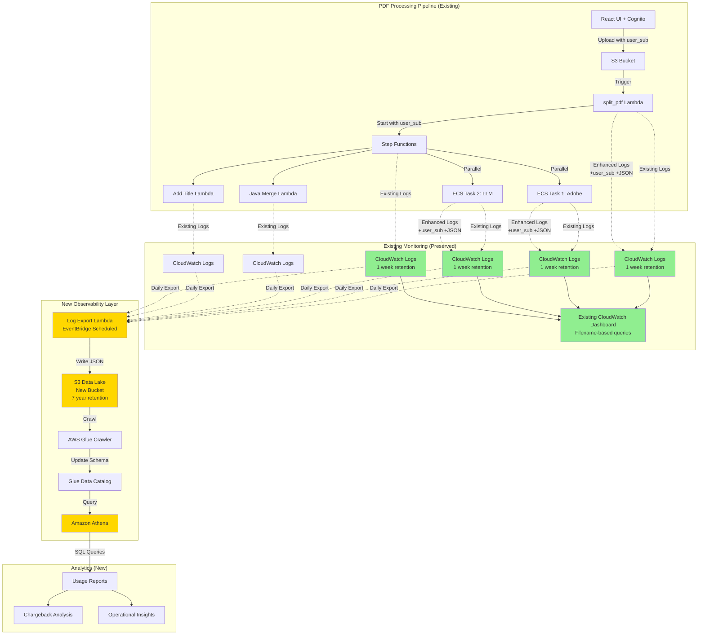

# Design Document: Observability and Usage Tracking

## Overview

This design **enhances** the existing CloudWatch logging infrastructure with user-centric tracking, structured logging, and long-term analytics capabilities. The system builds on the current logging setup (ECS log groups, Step Functions logs, Lambda logs, and CloudWatch Dashboard) by adding:

1. **User Context**: Associate all logs with Cognito user identity
2. **Structured JSON Logging**: Enhance existing logs with consistent schema
3. **Long-Term Storage**: Export logs to S3 data lake for 7-year retention
4. **SQL Analytics**: Enable Athena queries for chargeback and usage analysis

The solution leverages AWS native services including CloudWatch Logs with Embedded Metric Format (EMF), Lambda-based batch export for daily log archival, S3 for data lake storage, AWS Glue for schema management, and Amazon Athena for SQL queries.

### Existing Infrastructure (Preserved)

**Current CloudWatch Setup:**
- ECS Log Groups: `/ecs/MyFirstTaskDef/PythonContainerLogGroup`, `/ecs/MySecondTaskDef/JavaScriptContainerLogGroup` (1 week retention)
- Step Functions Log Group: `/aws/states/MyStateMachine_PDFAccessibility` (1 week retention, LogLevel.ALL)
- Lambda Log Groups: Auto-created by AWS (default retention)
- CloudWatch Dashboard: `PDF_Processing_Dashboard-{timestamp}` with filename-based filtering

**Current Logging Patterns:**
- Python ECS: `logging.info(f"Filename : {file_key} | {message}")`
- Lambda: `print(f"Filename - {pdf_file_key} | {message}")`
- Dashboard Queries: Pattern matching on "File: *, Status: *" and filename filtering

### Enhancement Strategy

**Phase 1: Add User Context (Non-Breaking)**
- Inject user_sub into S3 object metadata at upload
- Extract user_sub in Lambda/ECS and include in existing log messages
- Update log format: `f"user_sub={user_sub} | Filename={file_key} | {message}"`

**Phase 2: Structured Logging (Gradual Migration)**
- Add structured logger wrapper around existing `logging.info()` calls
- Emit both plain text (for existing dashboard) and JSON (for analytics)
- Use CloudWatch Embedded Metric Format for metrics

**Phase 3: Long-Term Storage**
- Deploy Lambda function for daily batch export of CloudWatch Logs
- Export to S3 data lake in JSON format (optionally convert to Parquet)
- Preserve existing 1-week CloudWatch retention for operational monitoring
- Use EventBridge scheduled rule to trigger daily exports

**Phase 4: Analytics Layer**
- Create Glue Data Catalog for exported logs
- Enable Athena queries for usage analysis
- Build chargeback reports without modifying existing dashboard

### Key Design Principles

1. **Backward Compatible**: Preserve all existing logging and dashboard functionality
2. **Gradual Enhancement**: Add capabilities without breaking current operations
3. **Dual Output**: Support both human-readable logs (existing) and structured logs (new)
4. **User-Centric Tracking**: Every operation associated with Cognito user (sub)
5. **Minimal Performance Impact**: Asynchronous logging with <5% overhead
6. **Cost-Effective Storage**: JSON format with intelligent tiering and lifecycle policies (optionally convert to Parquet for further cost savings)

## Architecture

### High-Level Architecture (Enhancement Approach)



**Legend:**
- 🟢 Green: Existing infrastructure (preserved, enhanced)
- 🟡 Yellow: New components (added for analytics)

### Component Interaction Flow

1. **User Upload**: User uploads PDF via React UI with Cognito authentication
2. **Context Injection**: Frontend adds user_sub to S3 object metadata
3. **Lambda Trigger**: split_pdf Lambda extracts user_sub from S3 metadata
4. **Step Functions**: Execution input includes user_sub for all downstream tasks
5. **ECS Tasks**: Receive user_sub via environment variables
6. **Structured Logging**: All components emit JSON logs with user_sub
7. **Daily Export**: EventBridge triggers Lambda to export previous day's logs
8. **Log Extraction**: Lambda queries CloudWatch Logs and filters for JSON entries
9. **Data Lake Storage**: JSON files stored in partitioned S3 structure
10. **Schema Management**: Glue Crawler updates table schemas
11. **Query Execution**: Athena queries data via Glue Data Catalog

## Components and Interfaces

### 1. User Context Propagation Module

**Purpose**: Ensure user identity (Cognito sub) flows through entire processing pipeline

**Components**:
- **Frontend Context Injector**: React component that adds user_sub to S3 object metadata
- **Lambda Context Extractor**: Utility function to extract user_sub from event sources
- **Step Functions Context Builder**: Constructs execution input with user context
- **ECS Environment Injector**: CDK construct that adds user_sub to container environment

**Interfaces**:

```python
# Lambda Context Extractor
def extract_user_context(event: dict) -> UserContext:
    """
    Extract user context from Lambda event.
    
    Args:
        event: Lambda event (S3, API Gateway, Step Functions)
    
    Returns:
        UserContext with user_sub, groups, job_id
    """
    pass

@dataclass
class UserContext:
    user_sub: str
    user_groups: List[str]
    job_id: str
    timestamp: str
```

```typescript
// Frontend Context Injector
interface UserMetadata {
  userSub: string;
  userGroups: string[];
  uploadTimestamp: string;
}

async function uploadWithUserContext(
  file: File,
  userMetadata: UserMetadata
): Promise<UploadResult>
```

### 2. Structured Logging Module (Enhancement)

**Purpose**: Enhance existing logging with structured JSON format while preserving current functionality

**Strategy**: Dual-output logging that maintains backward compatibility

**Components**:
- **Python Logger Wrapper**: Wraps existing `logging.info()` calls with structured output
- **JavaScript Logger Wrapper**: Wraps existing console.log with structured output
- **Java Logger Wrapper**: Wraps existing System.out with structured output
- **EMF Metric Emitter**: Emits CloudWatch metrics via Embedded Metric Format

**Implementation Approach**:

```python
# Python Structured Logger (wraps existing logging)
class EnhancedLogger:
    def __init__(self, service_name: str, user_context: Optional[UserContext] = None):
        self.service_name = service_name
        self.user_context = user_context
        self.legacy_logger = logging.getLogger(__name__)
    
    def info(self, message: str, **kwargs):
        """
        Enhanced logging that outputs both legacy format and structured JSON.
        
        Legacy format (for existing dashboard):
            "user_sub=abc123 | Filename=document.pdf | Processing completed"
        
        Structured format (for analytics):
            {"timestamp": "...", "user_sub": "abc123", "message": "Processing completed", ...}
        """
        # Legacy format for existing dashboard compatibility
        legacy_msg = self._format_legacy(message, **kwargs)
        self.legacy_logger.info(legacy_msg)
        
        # Structured JSON for analytics (separate log line)
        if self.user_context:
            structured_msg = self._format_structured(message, **kwargs)
            self.legacy_logger.info(json.dumps(structured_msg))
    
    def _format_legacy(self, message: str, **kwargs) -> str:
        """Format message for existing dashboard queries."""
        parts = []
        if self.user_context:
            parts.append(f"user_sub={self.user_context.user_sub}")
        if 'filename' in kwargs:
            parts.append(f"Filename={kwargs['filename']}")
        parts.append(message)
        return " | ".join(parts)
    
    def _format_structured(self, message: str, **kwargs) -> dict:
        """Format message as structured JSON for analytics."""
        return {
            "timestamp": datetime.utcnow().isoformat() + "Z",
            "user_sub": self.user_context.user_sub if self.user_context else None,
            "user_groups": self.user_context.user_groups if self.user_context else [],
            "job_id": self.user_context.job_id if self.user_context else None,
            "service_name": self.service_name,
            "message": message,
            **kwargs
        }
```

**Migration Strategy**:

1. **Phase 1**: Add EnhancedLogger alongside existing logging (no code changes)
2. **Phase 2**: Gradually replace `logging.info()` with `enhanced_logger.info()`
3. **Phase 3**: Existing dashboard continues to work with legacy format
4. **Phase 4**: New analytics queries use structured JSON format

**Example Migration**:

```python
# Before (existing code):
logging.info(f"Filename : {file_key} | Processing completed")

# After (enhanced):
enhanced_logger.info("Processing completed", filename=file_key, pages=150)

# Outputs both:
# Legacy: "user_sub=abc123 | Filename=document.pdf | Processing completed"
# Structured: {"timestamp": "...", "user_sub": "abc123", "filename": "document.pdf", "message": "Processing completed", "pages": 150}
```

**Log Schema** (Structured Format):

```json
{
  "timestamp": "2024-01-15T10:30:45.123Z",
  "user_sub": "abc123-def456-ghi789",
  "user_groups": ["AmazonUsers"],
  "job_id": "job-2024-01-15-abc123",
  "service_name": "split_pdf_lambda",
  "message": "PDF split completed",
  "filename": "document.pdf",
  "total_pages": 150,
  "chunks_created": 1,
  "s3_bucket": "pdfaccessibility-bucket",
  "s3_key": "pdf/document.pdf",
  "duration_ms": 2345,
  "memory_used_mb": 512
}
```

### 3. Batch Log Export Module (New)

**Purpose**: Export CloudWatch Logs to S3 Data Lake daily for long-term analytics without disrupting existing monitoring

**Strategy**: Daily Lambda-based export of structured JSON logs only, triggered by EventBridge

**Components**:
- **Export Lambda Function**: Queries CloudWatch Logs and exports to S3
- **EventBridge Scheduled Rule**: Triggers Lambda daily at 2 AM UTC
- **Log Filter Logic**: Extracts only structured JSON logs (ignores legacy format)
- **S3 Writer**: Writes logs to partitioned S3 structure
- **Export State Tracker**: DynamoDB table to track export progress and prevent duplicates

**Export Lambda Logic**:

```python
# Lambda function for daily log export
import boto3
import json
from datetime import datetime, timedelta
from typing import List, Dict

logs_client = boto3.client('logs')
s3_client = boto3.client('s3')
dynamodb = boto3.resource('dynamodb')

LOG_GROUPS = [
    "/ecs/MyFirstTaskDef/PythonContainerLogGroup",
    "/ecs/MySecondTaskDef/JavaScriptContainerLogGroup",
    "/aws/states/MyStateMachine_PDFAccessibility",
    "/aws/lambda/PDFAccessibility-SplitPDF",
    "/aws/lambda/PDFAccessibility-JavaLambda",
    "/aws/lambda/PDFAccessibility-AddTitleLambda",
]

def lambda_handler(event, context):
    """
    Export previous day's logs from CloudWatch to S3.
    Runs daily at 2 AM UTC via EventBridge.
    """
    # Calculate time range for previous day
    end_time = datetime.utcnow().replace(hour=0, minute=0, second=0, microsecond=0)
    start_time = end_time - timedelta(days=1)
    
    start_timestamp = int(start_time.timestamp() * 1000)
    end_timestamp = int(end_time.timestamp() * 1000)
    
    for log_group in LOG_GROUPS:
        export_log_group(log_group, start_timestamp, end_timestamp)
    
    return {
        'statusCode': 200,
        'body': json.dumps(f'Exported logs for {start_time.date()}')
    }

def export_log_group(log_group: str, start_time: int, end_time: int):
    """
    Export logs from a single log group to S3.
    Filters for JSON logs only.
    """
    service_name = extract_service_name(log_group)
    date = datetime.fromtimestamp(start_time / 1000)
    
    # S3 key with partitioning
    s3_key = f"logs/year={date.year}/month={date.month:02d}/day={date.day:02d}/service={service_name}/logs.json"
    
    # Query CloudWatch Logs for JSON entries
    query = """
    fields @timestamp, @message
    | filter @message like /^{/
    | sort @timestamp asc
    """
    
    query_id = logs_client.start_query(
        logGroupName=log_group,
        startTime=start_time,
        endTime=end_time,
        queryString=query
    )['queryId']
    
    # Wait for query to complete
    response = wait_for_query(query_id)
    
    # Write results to S3
    if response['results']:
        log_entries = [json.loads(result[1]['value']) for result in response['results']]
        
        s3_client.put_object(
            Bucket=os.environ['DATA_LAKE_BUCKET'],
            Key=s3_key,
            Body=json.dumps(log_entries, separators=(',', ':')),
            ContentType='application/json',
            ServerSideEncryption='aws:kms'
        )
        
        print(f"Exported {len(log_entries)} logs from {log_group} to s3://{os.environ['DATA_LAKE_BUCKET']}/{s3_key}")

def wait_for_query(query_id: str, max_wait: int = 60) -> Dict:
    """Wait for CloudWatch Logs Insights query to complete."""
    import time
    
    for _ in range(max_wait):
        response = logs_client.get_query_results(queryId=query_id)
        if response['status'] in ['Complete', 'Failed', 'Cancelled']:
            return response
        time.sleep(1)
    
    raise TimeoutError(f"Query {query_id} did not complete within {max_wait} seconds")

def extract_service_name(log_group: str) -> str:
    """Extract service name from log group name."""
    # /aws/lambda/PDFAccessibility-SplitPDF -> split_pdf_lambda
    # /ecs/MyFirstTaskDef/PythonContainerLogGroup -> ecs_adobe_task
    if '/lambda/' in log_group:
        return log_group.split('/')[-1].lower().replace('-', '_') + '_lambda'
    elif '/ecs/' in log_group:
        if 'Python' in log_group:
            return 'ecs_adobe_task'
        else:
            return 'ecs_llm_task'
    elif '/states/' in log_group:
        return 'step_functions'
    return 'unknown'
```

**CDK Configuration**:

```python
# Create export Lambda function
export_lambda = lambda_.Function(
    self, 'LogExportLambda',
    runtime=lambda_.Runtime.PYTHON_3_12,
    handler='index.lambda_handler',
    code=lambda_.Code.from_asset('lambda/log_export'),
    timeout=Duration.minutes(15),
    memory_size=512,
    environment={
        'DATA_LAKE_BUCKET': data_lake_bucket.bucket_name,
        'LOG_GROUPS': ','.join(LOG_GROUPS)
    }
)

# Grant permissions
data_lake_bucket.grant_write(export_lambda)
export_lambda.add_to_role_policy(iam.PolicyStatement(
    actions=[
        'logs:StartQuery',
        'logs:GetQueryResults',
        'logs:DescribeLogGroups',
        'logs:DescribeLogStreams'
    ],
    resources=['*']
))

# Create EventBridge rule for daily execution
rule = events.Rule(
    self, 'DailyLogExportRule',
    schedule=events.Schedule.cron(
        minute='0',
        hour='2',  # 2 AM UTC
        month='*',
        week_day='*',
        year='*'
    )
)

rule.add_target(targets.LambdaFunction(export_lambda))
```

**Key Points**:
- ✅ Existing log groups remain unchanged (no retention changes)
- ✅ Existing dashboard continues to work (uses legacy format logs)
- ✅ Only structured JSON logs are exported to S3
- ✅ No impact on current operational monitoring
- ✅ Daily export provides sufficient granularity for chargeback reporting
- ✅ Lower cost than real-time streaming (~$83/year vs ~$104/year)
- ✅ Simpler architecture, easier to maintain and troubleshoot
- ✅ AWS-recommended pattern for log archival

### 4. Data Lake Storage Module (New)

**Purpose**: Store processed logs in cost-effective, query-optimized format for long-term analytics

**Strategy**: Separate storage from operational monitoring (CloudWatch for ops, S3 for analytics)

**Components**:
- **S3 Data Lake Bucket**: Stores Parquet files with partitioning (new bucket)
- **Lifecycle Policies**: Manages data tiering and retention (7 years)
- **Encryption**: KMS encryption for data at rest

**Retention Strategy**:
- **CloudWatch Logs**: Keep existing 1-week retention for operational monitoring
- **S3 Data Lake**: 7-year retention for compliance and analytics
- **Rationale**: CloudWatch for real-time ops, S3 for historical analysis

**Partitioning Strategy**:

```
s3://pdf-accessibility-data-lake/
├── logs/
│   ├── year=2024/
│   │   ├── month=01/
│   │   │   ├── day=15/
│   │   │   │   ├── service=split_pdf_lambda/
│   │   │   │   │   └── logs.json
│   │   │   │   ├── service=ecs_adobe_task/
│   │   │   │   │   └── logs.json
│   │   │   │   ├── service=ecs_llm_task/
│   │   │   │   │   └── logs.json
│   │   │   │   ├── service=merge_lambda/
│   │   │   │   │   └── logs.json
│   │   │   │   └── service=add_title_lambda/
│   │   │   │       └── logs.json
```

**Lifecycle Policy**:

```python
data_lake_bucket.add_lifecycle_rule(
    id="IntelligentTiering",
    transitions=[
        s3.Transition(
            storage_class=s3.StorageClass.INTELLIGENT_TIERING,
            transition_after=Duration.days(0)
        ),
        s3.Transition(
            storage_class=s3.StorageClass.GLACIER_FLEXIBLE_RETRIEVAL,
            transition_after=Duration.days(365)
        )
    ],
    expiration=Duration.days(2555)  # 7 years
)
```

**Key Points**:
- ✅ Separate from existing S3 buckets (pdfaccessibility-*, pdf2html-bucket-*)
- ✅ Does not interfere with PDF processing storage
- ✅ Optimized for analytics queries, not operational access

### 5. AWS Glue Data Catalog Module

**Purpose**: Provide schema registry and metadata management

**Components**:
- **Glue Database**: Container for all usage tracking tables
- **Glue Tables**: Schema definitions for each log type
- **Glue Crawlers**: Automatic schema discovery and updates
- **Partition Projection**: Optimizes partition discovery

**Table Definitions**:

```python
# Usage Logs Table (JSON format)
usage_logs_table = glue.CfnTable(
    self, "UsageLogsTable",
    catalog_id=account_id,
    database_name="pdf_accessibility_usage",
    table_input={
        "name": "usage_logs",
        "storage_descriptor": {
            "columns": [
                {"name": "timestamp", "type": "timestamp"},
                {"name": "user_sub", "type": "string"},
                {"name": "user_groups", "type": "array<string>"},
                {"name": "job_id", "type": "string"},
                {"name": "service_name", "type": "string"},
                {"name": "event_type", "type": "string"},
                {"name": "request_id", "type": "string"},
                {"name": "details", "type": "struct<...>"},
                {"name": "metrics", "type": "struct<...>"}
            ],
            "location": f"s3://{data_lake_bucket.bucket_name}/logs/",
            "input_format": "org.apache.hadoop.mapred.TextInputFormat",
            "output_format": "org.apache.hadoop.hive.ql.io.HiveIgnoreKeyTextOutputFormat",
            "serde_info": {
                "serialization_library": "org.openx.data.jsonserde.JsonSerDe",
                "parameters": {
                    "serialization.format": "1"
                }
            }
        },
        "partition_keys": [
            {"name": "year", "type": "string"},
            {"name": "month", "type": "string"},
            {"name": "day", "type": "string"},
            {"name": "service", "type": "string"}
        ]
    }
)

# Optional: Add Glue Crawler for automatic schema discovery
crawler = glue.CfnCrawler(
    self, "UsageLogsCrawler",
    name="pdf-accessibility-usage-crawler",
    role=crawler_role.role_arn,
    database_name="pdf_accessibility_usage",
    targets={
        "s3Targets": [{
            "path": f"s3://{data_lake_bucket.bucket_name}/logs/"
        }]
    },
    schedule={
        "scheduleExpression": "cron(0 3 * * ? *)"  # Run daily at 3 AM UTC (after export)
    },
    schema_change_policy={
        "updateBehavior": "UPDATE_IN_DATABASE",
        "deleteBehavior": "LOG"
    }
)
```

**Note on Format Choice**:
- **JSON Format**: Simpler to implement, human-readable, easier to debug
- **Optional Parquet Conversion**: Can add a separate Lambda to convert JSON to Parquet for cost savings (50% reduction) if needed in the future
- **Athena Performance**: JSON works well for moderate query volumes; Parquet recommended for high-volume analytics

### 6. Amazon Athena Query Module

**Purpose**: Enable SQL-based analytics on usage data

**Components**:
- **Athena Workgroup**: Isolated query execution environment
- **Query Result Bucket**: Stores query results
- **Saved Queries**: Pre-built queries for common use cases
- **Query Optimizer**: Partition pruning and query hints

**Pre-Built Queries**:

```sql
-- Query 1: Total usage by user for date range
SELECT 
    user_sub,
    user_groups,
    COUNT(DISTINCT job_id) as total_jobs,
    SUM(CAST(json_extract_scalar(details, '$.total_pages') AS INTEGER)) as total_pages,
    SUM(CAST(json_extract_scalar(metrics, '$.duration_ms') AS DOUBLE)) / 1000 as total_duration_seconds
FROM usage_logs
WHERE year = '2024' 
    AND month = '01'
    AND event_type = 'pdf_split_complete'
GROUP BY user_sub, user_groups
ORDER BY total_pages DESC;

-- Query 2: Bedrock usage by model and user
SELECT 
    user_sub,
    json_extract_scalar(details, '$.model_id') as model_id,
    COUNT(*) as invocation_count,
    SUM(CAST(json_extract_scalar(metrics, '$.input_tokens') AS INTEGER)) as total_input_tokens,
    SUM(CAST(json_extract_scalar(metrics, '$.output_tokens') AS INTEGER)) as total_output_tokens,
    AVG(CAST(json_extract_scalar(metrics, '$.latency_ms') AS DOUBLE)) as avg_latency_ms
FROM usage_logs
WHERE year = '2024'
    AND month = '01'
    AND event_type = 'bedrock_invoke'
GROUP BY user_sub, json_extract_scalar(details, '$.model_id')
ORDER BY total_input_tokens DESC;

-- Query 3: Adobe API usage patterns
SELECT 
    user_sub,
    json_extract_scalar(details, '$.api_operation') as api_operation,
    COUNT(*) as call_count,
    AVG(CAST(json_extract_scalar(metrics, '$.response_time_ms') AS DOUBLE)) as avg_response_time_ms,
    SUM(CASE WHEN json_extract_scalar(details, '$.status_code') != '200' THEN 1 ELSE 0 END) as error_count
FROM usage_logs
WHERE year = '2024'
    AND month = '01'
    AND service = 'ecs_adobe_task'
GROUP BY user_sub, json_extract_scalar(details, '$.api_operation')
ORDER BY call_count DESC;
```

## Data Models

### Core Data Structures

```python
@dataclass
class UserContext:
    """User identity and context information."""
    user_sub: str
    user_groups: List[str]
    organization: Optional[str]
    country: Optional[str]
    
@dataclass
class JobContext:
    """Job-level tracking information."""
    job_id: str
    user_sub: str
    original_filename: str
    total_pages: int
    upload_timestamp: str
    pipeline_type: str  # "pdf2pdf" or "pdf2html"
    
@dataclass
class LogEntry:
    """Base structure for all log entries."""
    timestamp: str
    user_sub: str
    user_groups: List[str]
    job_id: str
    service_name: str
    event_type: str
    request_id: str
    details: dict
    metrics: Optional[dict]
    
@dataclass
class AWSServiceMetrics:
    """Metrics for AWS service usage."""
    service: str
    operation: str
    duration_ms: float
    status: str
    resource_usage: dict  # CPU, memory, etc.
    
@dataclass
class BedrockMetrics:
    """Bedrock-specific metrics."""
    model_id: str
    input_tokens: int
    output_tokens: int
    latency_ms: float
    invocation_count: int
    
@dataclass
class AdobeAPIMetrics:
    """Adobe API-specific metrics."""
    api_operation: str
    response_time_ms: float
    status_code: str
    error_message: Optional[str]
```

### Glue Table Schemas

**usage_logs Table**:

| Column | Type | Description |
|--------|------|-------------|
| timestamp | timestamp | Event timestamp (ISO 8601) |
| user_sub | string | Cognito user identifier |
| user_groups | array<string> | User's Cognito groups |
| job_id | string | Unique job identifier |
| service_name | string | AWS service/component name |
| event_type | string | Event type (e.g., "pdf_split_complete") |
| request_id | string | AWS request ID |
| details | struct | Event-specific details (JSON) |
| metrics | struct | Quantitative metrics (JSON) |
| year | string | Partition: Year (YYYY) |
| month | string | Partition: Month (MM) |
| day | string | Partition: Day (DD) |
| service | string | Partition: Service name |

**bedrock_usage Table**:

| Column | Type | Description |
|--------|------|-------------|
| timestamp | timestamp | Invocation timestamp |
| user_sub | string | Cognito user identifier |
| job_id | string | Associated job ID |
| model_id | string | Bedrock model identifier |
| input_tokens | int | Input token count |
| output_tokens | int | Output token count |
| latency_ms | double | Invocation latency |
| year | string | Partition: Year |
| month | string | Partition: Month |
| day | string | Partition: Day |

**adobe_api_usage Table**:

| Column | Type | Description |
|--------|------|-------------|
| timestamp | timestamp | API call timestamp |
| user_sub | string | Cognito user identifier |
| job_id | string | Associated job ID |
| api_operation | string | Adobe API operation |
| response_time_ms | double | Response time |
| status_code | string | HTTP status code |
| error_message | string | Error message (if any) |
| year | string | Partition: Year |
| month | string | Partition: Month |
| day | string | Partition: Day |


## Correctness Properties

*A property is a characteristic or behavior that should hold true across all valid executions of a system—essentially, a formal statement about what the system should do. Properties serve as the bridge between human-readable specifications and machine-verifiable correctness guarantees.*

### Property Reflection

After analyzing all acceptance criteria, I identified several areas where properties can be consolidated:

1. **Log Field Presence**: Requirements 2.3-2.8 all test that specific fields are present in logs for different services. These can be consolidated into a single property that validates service-specific fields based on service type.

2. **User Context Propagation**: Requirements 1.1-1.6 all test that user_sub flows through the system. These can be consolidated into properties that test context propagation at key boundaries.

3. **Metrics Logging**: Requirements 4.1-4.6 all test that service metrics are logged. These can be consolidated into a property that validates metric presence based on service type.

4. **Query Support**: Requirements 10.4-10.9 are all examples of specific queries working correctly, not universal properties.

5. **Error Logging**: Requirements 14.1-14.5 test error logging completeness and can be consolidated.

### Core Properties

**Property 1: User Context Propagation Completeness**

*For any* PDF processing job initiated by an authenticated user, the user's Cognito sub SHALL be present in all log entries generated by every component (Lambda, ECS, Step Functions) involved in processing that job.

**Validates: Requirements 1.1, 1.2, 1.3, 1.4, 1.5, 1.6**

**Property 2: JSON Log Validity**

*For any* log entry emitted by any component, the log SHALL be valid JSON that can be parsed without errors.

**Validates: Requirements 2.1**

**Property 3: Mandatory Log Fields Presence**

*For any* log entry, the log SHALL contain all mandatory fields: timestamp, user_sub, job_id, service_name, and event_type.

**Validates: Requirements 2.2**

**Property 4: Service-Specific Log Fields**

*For any* log entry from a specific service type (Lambda, ECS, Step Functions, Bedrock, Adobe API, S3), the log SHALL contain all required fields for that service type as defined in the logging schema.

**Validates: Requirements 2.3, 2.4, 2.5, 2.6, 2.7, 2.8**

**Property 5: Page Count Accuracy**

*For any* PDF processing job, the sum of page counts logged across all chunks SHALL equal the total page count of the original PDF.

**Validates: Requirements 3.1, 3.2, 3.3, 3.4**

**Property 6: Service Metrics Completeness**

*For any* AWS service operation (Lambda, ECS, Step Functions, S3, Bedrock), the logged metrics SHALL include all required metrics for that service type with valid start and end timestamps.

**Validates: Requirements 4.1, 4.2, 4.3, 4.4, 4.5, 4.6**

**Property 7: Adobe API Logging Completeness**

*For any* Adobe API call made during PDF processing, the system SHALL log the API operation type, user_sub, job_id, response time, and status code.

**Validates: Requirements 5.1, 5.2, 5.4**

**Property 8: Job ID Uniqueness**

*For any* two distinct PDF upload events, the generated job_ids SHALL be unique.

**Validates: Requirements 6.1**

**Property 9: Job ID Propagation**

*For any* log entry generated during a PDF processing job, the log SHALL contain the job_id associated with that job.

**Validates: Requirements 6.2, 6.3, 6.5**

**Property 10: Log Group Naming Convention**

*For any* CloudWatch Log Group created by the observability system, the log group name SHALL follow the pattern `/aws/{service}/{resource-name}`.

**Validates: Requirements 7.4**

**Property 11: JSON Format Validity**

*For any* log data exported to S3, the exported file SHALL be valid JSON that can be read by Athena.

**Validates: Requirements 8.2**

**Property 12: S3 Partitioning Pattern**

*For any* log data written to S3, the S3 key SHALL follow the partitioning pattern `year=YYYY/month=MM/day=DD/service={service_name}/`.

**Validates: Requirements 8.3**

**Property 13: JSON Compression (Optional)**

*For any* JSON file written to S3, the file MAY be compressed using GZIP compression to reduce storage costs.

**Validates: Requirements 8.4**

**Property 14: Glue Partition Key Alignment**

*For any* Glue table defined for usage logs, the partition keys SHALL match the S3 partitioning structure (year, month, day, service).

**Validates: Requirements 9.5**

**Property 15: User Groups in Query Results**

*For any* usage query result that includes user information, the result SHALL include the user's Cognito groups.

**Validates: Requirements 11.4**

**Property 16: Asynchronous Logging**

*For any* log write operation, the logging call SHALL be non-blocking and return immediately without waiting for CloudWatch API response.

**Validates: Requirements 13.2**

**Property 17: Log Batching**

*For any* sequence of log entries generated within a 1-second window by the same component, the system SHALL batch them into a single CloudWatch Logs API call when possible.

**Validates: Requirements 13.3**

**Property 18: Error Logging Completeness**

*For any* exception or error that occurs during PDF processing, the system SHALL log the error message, stack trace, user_sub, job_id, and error category (user_error, system_error, or external_service_error).

**Validates: Requirements 14.1, 14.2, 14.3, 14.5**

**Property 19: Critical Error Metric Emission**

*For any* critical error (system_error or external_service_error), the system SHALL emit a CloudWatch metric for alerting purposes.

**Validates: Requirements 15.3**

**Property 20: Log Field Validation**

*For any* structured log entry, the system SHALL validate that all required fields are present before writing to CloudWatch Logs.

**Validates: Requirements 16.1**

**Property 21: Malformed Log Handling**

*For any* malformed log entry that fails validation, the system SHALL log the validation error and continue processing without throwing an exception.

**Validates: Requirements 16.2**

**Property 22: JSON Schema Validation**

*For any* structured log entry, the system SHALL validate the log against the defined JSON Schema before writing.

**Validates: Requirements 16.3**

**Property 23: Numeric Metric Range Validation**

*For any* numeric metric in a log entry (duration_ms, memory_used_mb, token counts), the value SHALL be within the expected range for that metric type (e.g., duration_ms >= 0, memory_used_mb > 0).

**Validates: Requirements 16.5**

**Property 24: Log Group Name Uniqueness**

*For any* two CloudWatch Log Groups created by the observability system, the log group names SHALL be unique and not conflict with existing log groups.

**Validates: Requirements 18.3**

## Error Handling

### Error Categories

The system categorizes all errors into three types:

1. **user_error**: Errors caused by invalid user input or quota violations
   - Examples: Invalid PDF format, file too large, quota exceeded
   - Handling: Log error, return user-friendly message, do not retry

2. **system_error**: Errors within our control (bugs, configuration issues)
   - Examples: Lambda timeout, out of memory, null pointer exception
   - Handling: Log error with stack trace, emit CloudWatch alarm, retry with exponential backoff

3. **external_service_error**: Errors from external services (AWS, Adobe)
   - Examples: Bedrock throttling, Adobe API timeout, S3 service unavailable
   - Handling: Log error, retry with exponential backoff, emit CloudWatch alarm if persistent

### Error Logging Schema

```json
{
  "timestamp": "2024-01-15T10:30:45.123Z",
  "user_sub": "abc123-def456-ghi789",
  "job_id": "job-2024-01-15-abc123",
  "service_name": "ecs_adobe_task",
  "event_type": "error",
  "error_category": "external_service_error",
  "error_message": "Adobe API timeout after 30 seconds",
  "stack_trace": "...",
  "details": {
    "api_operation": "autoTag",
    "retry_attempt": 2,
    "max_retries": 3
  }
}
```

### Retry Strategy

- **Exponential Backoff**: Base delay of 1 second, multiplier of 2, max 3 retries
- **Jitter**: Add random jitter (0-1 second) to prevent thundering herd
- **Circuit Breaker**: After 5 consecutive failures, pause for 60 seconds before retrying

### Validation Errors

When log validation fails:
1. Log the validation error with the malformed log content
2. Continue processing (do not throw exception)
3. Emit CloudWatch metric for monitoring validation failure rate
4. If validation failure rate exceeds 5%, emit alarm

## Testing Strategy

### Dual Testing Approach

The observability system requires both unit tests and property-based tests for comprehensive coverage:

**Unit Tests**: Focus on specific examples, edge cases, and integration points
- Test specific log formats for each service type
- Test error handling for specific error scenarios
- Test CDK infrastructure synthesis
- Test Athena query execution for specific queries
- Test data deletion for GDPR compliance

**Property-Based Tests**: Verify universal properties across all inputs
- Generate random user contexts and verify propagation
- Generate random log entries and verify schema compliance
- Generate random job IDs and verify uniqueness
- Generate random metrics and verify range validation
- Generate random errors and verify categorization

### Property-Based Testing Configuration

- **Library**: Use `hypothesis` for Python, `fast-check` for TypeScript/JavaScript
- **Iterations**: Minimum 100 iterations per property test
- **Tagging**: Each property test must reference its design document property

Example property test tag:
```python
# Feature: observability-usage-tracking, Property 1: User Context Propagation Completeness
@given(user_context=user_context_strategy(), job_events=job_events_strategy())
def test_user_context_propagation(user_context, job_events):
    # Test that user_sub appears in all log entries for a job
    pass
```

### Integration Testing

Integration tests verify end-to-end data flow:

1. **Log to S3 Flow**: Generate logs → CloudWatch → Firehose → S3 → Verify Parquet
2. **Query Flow**: Write logs → Export to S3 → Crawl with Glue → Query with Athena
3. **User Context Flow**: Upload PDF → Verify user_sub in all component logs
4. **Error Flow**: Trigger error → Verify error log → Verify CloudWatch metric

### Performance Testing

Performance tests validate observability overhead:

1. **Cold Start Impact**: Measure Lambda cold start time with/without observability
2. **Execution Overhead**: Measure total execution time with/without logging
3. **Query Performance**: Measure Athena query time for common queries
4. **Log Latency**: Measure time from log write to query availability

### Test Data Generation

Use property-based testing libraries to generate:
- Random user contexts (user_sub, groups, attributes)
- Random job IDs (UUID format)
- Random log entries (valid and invalid)
- Random metrics (within and outside expected ranges)
- Random timestamps (past, present, future)
- Random error scenarios (all three categories)

### Backward Compatibility Testing

Verify no breaking changes:
1. Deploy observability stack to test environment
2. Run existing PDF processing workflows
3. Verify all workflows complete successfully
4. Verify existing CloudWatch Dashboards still function
5. Verify no changes to Lambda function code (only env vars and IAM)
